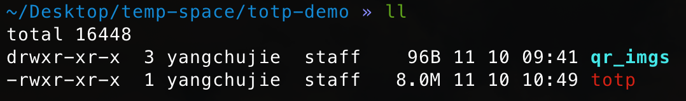

## TOTP 动态密码管理器

### 简介

    动态密码二次验证在业务系统中是很常见的安全保障手段，目前常规手段是使用手机 APP 来进行账号管理以及动态密码的查看，而我们通常是在 PC 端的浏览器中进行验证码的输入，此时要去拿手机，开 APP 查看就显得比较麻烦，对于习惯了使用命令行的用户，可能希望 PC 端直接使用命令就查看了密码然后直接进行输入。基于此目的我做了一个小工具自己使用，各位看官觉得使用符合你的习惯，可以参照下面使用方式进行使用。

### 使用方式

*   在右侧「Release」下载对应操作系统的执行文件

*   放到电脑任意目录，在该目录下创建一个 qr_imgs 文件夹，放入需要管理的二次验证 Secret 的二维码文件

    

*   在该目录使用命令运行该执行文件查看已管理的账号信息：

    >   ./totp accounts

    

*   在该目录使用命令查看对应账号的当前动态密码：

    >   ./totp code --account=XXXXXXX  (上一步列出来的账号)

    

### 广告时间

    你还在为手头项目事项杂乱而烦恼吗？你还在为项目延期而着急上火吗？你还在为项目范围频繁变更而左右撕逼吗？
    让「项目管理」来助你一臂之力吧！了解 PMI 项目管理知识体系，获得 PMP 认证。
    让你的工作有方法论护航。
    微信扫码参加学习吧！

     
